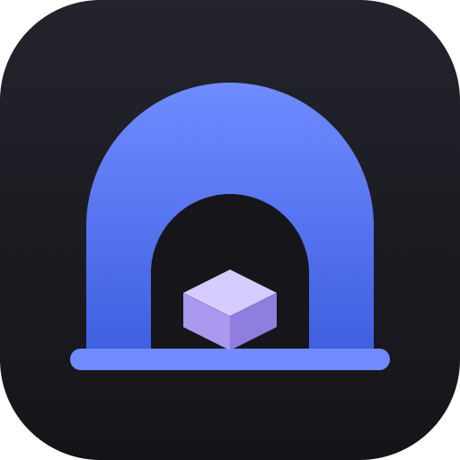
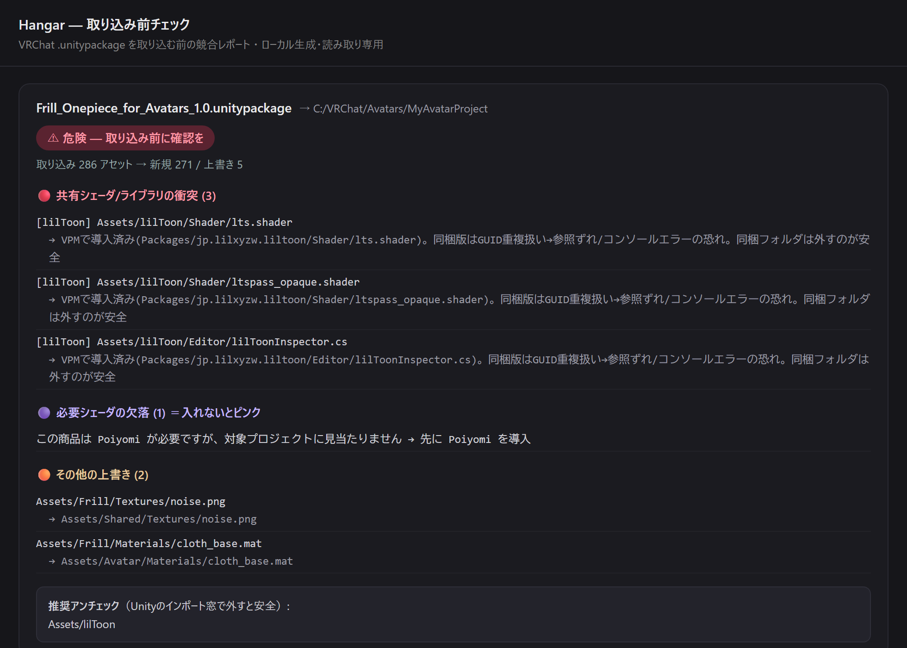

# Hangar — VRChat の .unitypackage を「ぜんぶ見える棚」に

[](https://github.com/akagifreeez/hangar/releases/latest)
[](LICENSE)

<br clear="left">

> **「買ったはずのアバター、どれだっけ？」** を解決する VRChat 向けデスクトップアプリ。

BOOTH などで買い集めた `.unitypackage`（アバター・衣装・小物・ギミック）を、**Unity で開かずに**棚卸し・検索・プレビューし、新しい商品を**取り込む前に「アバターがピンクになる事故」を止めます**。すべてローカル・読み取り専用で動く非公式ツールです（Windows 専用・インストール不要）。

**▶ ダウンロード:** [最新リリース](https://github.com/akagifreeez/hangar/releases/latest) から `Hangar-…-portable-win-x64.zip` を取得 → 展開して **`Hangar.cmd`** から起動。



> ↑ 新しい衣装を取り込む前に「既存の lilToon と衝突する／必要な Poiyomi が足りない（＝ピンク化）」を先に教えてくれる画面（表示は一例）。

### こんな経験ありませんか

- 買ったはずなのに、**どれがどれだか分からない**
- 同じものを**二重に買った**／コピーが散らばって**容量を圧迫**している
- このアバター、**どの Unity プロジェクトに入れたっけ**
- 新しい衣装を入れたら、アバターが急に**まっピンク**になった

Hangar はこれを全部、Unity を開かずに解決します。

## 主な機能

### 📦 取り込み前チェック（ピンク化・上書き事故を予防）

新しい `.unitypackage` を**取り込む前に**、対象の Unity プロジェクトと照合して「**既存の何を上書きするか**」「**足りないシェーダはないか**」を表示。lilToon / Poiyomi の二重定義やバージョン降格、必要シェーダの欠落といった**アバターがピンクになる取り込み事故**を未然に防ぎます。`.unitypackage` を**ウィンドウにドラッグ&ドロップ**するだけ。共有用の HTML レポートも出力できます。すでに入れた商品の入れ直しは誤警告しません。

### 🎯 導入チェック（どの商品をどのプロジェクトに入れたか）

購入物と Unity プロジェクトを照合し、「**導入済み / 未導入 / 一部だけ導入（％）**」を自動判定。昔入れたものも今から判定でき、**二重導入も警告**します。**複数プロジェクトをまとめた上位フォルダ**（例: `…\ALCOM\Projects`）を選べば、配下の各プロジェクトをまとめて検出します。

### 🗂️ カタログ化（Unity で開かずに一覧）

フォルダを指定すると中の `.unitypackage` を**展開せず**に解析し、サムネ付きグリッドで一覧。中身（ファイル構成・プレビュー画像）も閲覧できます。2 回目以降の再スキャンは**変更分だけ**を見るので一瞬で終わります。

### 🏷️ 種別の自動分類

3Dモデル / ツール / アニメ / マテリアル に自動で振り分けてタブで絞り込み。lilToon・Poiyomi・SDK などの**ツールが棚に埋もれません**。

### 🔁 重複検出・整理（🧹）

中身が同じコピーを束ねて、無駄な重複容量を可視化。ツールバーの「🛠 ツール → 🔀 プロジェクト比較 → 🧹 重複整理」から、整理プランを書き出せます。プランは**削除ではなく「隔離フォルダへ移動」する可逆な形**（PowerShell スクリプト）なので安全です（実行はあなた・確認後に隔離フォルダを削除して初めて空きます）。

### 🔀 プロジェクト横断比較 / 散らばり俯瞰

複数の Unity プロジェクトを突き合わせ、「**共通 / 一方だけ / 版違い**」の導入商品を一覧。lilToon・Poiyomi・VRChat SDK・Modular Avatar などの **VPM 版差**（例: lilToon 1.9.0 ⇔ 2.3.2）も検出し、**移行時にピンクになりそうな所**を先に教えます。「**A→B 移行ギャップ**」では、B を A に揃えるなら追加で入れ直すべき商品を、ライブラリに現物があるか付きで提示。「**📊 散らばり**」では、同じ商品が何プロジェクトに散らばって容量を二重化しているかを俯瞰できます。

### ♻️ 再現テンプレ（任意）

改変済みアバターのプロジェクトから「**自分が作ったファイルだけ**」を保存し、「**どの購入物が必要か**」のリストを書き出します（購入物そのものは含めません）。別 PC・新バリエーションの土台づくりに。

### 🎬 忠実プレビュー（任意）

Unity と lilToon / Poiyomi が手元にあれば、本物のシェーダで多角度プレビュー画像 + ブラウザで回せる 3D(GLB) を生成。**1 つの商品に複数のプレハブ（衣装・小物のセット等）があれば個別に焼いて、ビューアでタブ切替**できます。**無くてもカタログ機能はそのまま使えます**。

## ダウンロードと初回起動

1. [Releases](https://github.com/akagifreeez/hangar/releases/latest) から `Hangar-…-portable-win-x64.zip` をダウンロードして展開します（インストール不要）。
2. **`Hangar.cmd`** をダブルクリックして起動します（環境によって `Hangar.exe` を直接実行すると正しく立ち上がらない場合があるため、まずは `.cmd` を使ってください）。
3. **SmartScreen の警告が出たら**（未署名アプリのため）：「**詳細情報**」をクリック →「**実行**」を選びます。これは Microsoft の有料コード署名を行っていないため表示されるもので、ソースは [GitHub](https://github.com/akagifreeez/hangar) で公開しています。

### はじめかた

1. `Hangar.cmd` を実行。
2. 「📁 ライブラリをスキャン」で `.unitypackage` の保存フォルダ（BOOTH のダウンロード先など）を選択。
3. グリッドに並んだ商品をクリックすると詳細（中身・プレビュー・導入台帳）が開きます。
4. 「🎯 プロジェクト検出」で Unity プロジェクトを選ぶと、どこに何が導入済みかが分かります。
5. 新しい `.unitypackage` を取り込む前に「📦 取り込み前チェック」で、その商品が既存プロジェクトの**何を上書きするか／足りないシェーダはないか**を確認できます（`.unitypackage` をウィンドウにドロップするだけでもOK）。
6. （任意）3Dモデルの**カードまたは詳細にある 🎬 ボタン**で忠実プレビューを生成（Unity + lilToon/Poiyomi が必要。詳細は下記）。検索やフィルタ・スクロール位置はスキャンや生成をはさんでも保持されます。
7. （任意・詳しい人向け）ツールバーの「🛠 ツール」から、再スキャン・再現テンプレ・**プロジェクト比較／散らばり俯瞰**が使えます。

> ツールバーは既定で「スキャン・プロジェクト検出・取り込み前チェック」の 3 つだけを表示し、上級機能は「🛠 ツール」に畳んでいます。

データ（カタログDB・キャッシュ・生成カタログ）はアプリのユーザーデータフォルダに保存され、購入物そのものには触れません。

## 忠実プレビュー（3D生成）について

- **必須**: Unity Hub に Unity 2022.3 系、および lilToon（Poiyomi 利用アバターなら Poiyomi も）。
- 本アプリは **シェーダを同梱しません**（再配布を避けるため）。あなたの環境にある lilToon / Poiyomi を一時利用します。「🎯 プロジェクト検出」で lilToon/Poiyomi を入れたプロジェクトを登録しておくと自動で見つかります（環境変数 `HANGAR_LILTOON` / `HANGAR_POIYOMI` で明示指定も可）。
- 生成物は**ベイク済み・リグ無しの GLB**で、アバターとしては使えません（プレビュー専用＝安全側）。

## プライバシー / 安全性

> **VRChat 非公式ツール** ／ すべて **ローカルのみ・読み取り専用** で動作します。外部送信・自動ログイン・スクレイピング・ファイル改変は一切行いません。

[PRIVACY.md](PRIVACY.md) を参照。要点:

- **ネットワーク送信なし**（3D ビューアの three.js を CDN から読む時だけ通信。オフラインでもカタログは動作）。
- **読み取り専用**。購入物の**変換も再配布もしません**。BOOTH 等への**自動ログイン・スクレイピングをしません**。
- 解析時に読むのは `.meta` の GUID 行とパッケージのメンバ情報のみ。

## ライセンス

本体は MIT ライセンス（[LICENSE](LICENSE)）。同梱・利用するサードパーティは [THIRD_PARTY_NOTICES.md](THIRD_PARTY_NOTICES.md) を参照。
**VRChat / BOOTH / lilToon / Poiyomi とは無関係の非公式ツールです。**

---

## 開発（ソースから動かす）

要件: Node 24 系（`node:sqlite` 利用）。

```bash
npm install
npm run build           # TypeScript → dist/
npm run cli -- scan <ライブラリフォルダ>     # 解析してカタログ登録
npm run cli -- list                         # 一覧
npm run cli -- detect [--save] <Unityプロジェクト...>   # 導入逆引き(--saveで記録・上位フォルダ可)
npm run cli -- compare <ProjA> <ProjB> [..] [--all] [--json] [--html out.html]   # プロジェクト横断比較(共通/Aのみ/Bのみ・版差・移行ギャップ)
npm run cli -- sprawl [--min N] [--json]                # 散らばり俯瞰(複数プロジェクトに散在する商品)
npm run cli -- list-projects [--json]                   # 登録済みプロジェクト一覧
npm run cli -- prune-projects [--json]                  # 不正な登録(不在/Assets無し)を掃除
npm run cli -- diff <pkg.unitypackage> --project <Unityプロジェクト>   # 取り込み前チェック(--json / --html out.html)
npm run cli -- save-template <Unityプロジェクト> --out <テンプレ出力先>  # 自作分を保存＋依存購入物をマニフェスト化(購入バイト非同梱)
npm run cli -- restore-template <テンプレ> --project <まっさらなプロジェクト>  # 復元＋「持ってる/入れ直して」台帳(既定は既存保護・--forceで上書き)
npm run cli -- catalog out.html             # カタログHTML生成(種別バッジ/フィルタ付き)
npm run cli -- render <商品名の一部>         # 忠実プレビュー生成(Unity必要。--sig <内容署名> でも指定可)
npm run cli -- version                       # バージョン表示(--version / -v も可)
npm run gui             # Electron GUI（system Node 不要・Electron内蔵Nodeで動作）
```
（`HANGAR_DB` / `HANGAR_CACHE` / `HANGAR_DATA` 環境変数でパス指定可）

技術的な要は **GUID 突合**（プロジェクトの `.meta` GUID × 購入物の GUID）。これにより導入の遡及検出・取り込み前の競合 diff・重複の同定を、すべて読み取り専用・外部通信なしで実現しています。

| `src/` | 役割 |
|---|---|
| `unitypackage.ts` | .unitypackage を展開せずストリーム解析 → guid/pathname/種別/preview/カテゴリ |
| `classify.ts` | アセット分類（拡張子+Importer）＋パッケージ種別分類（3Dモデル/ツール/アニメ/マテリアル） |
| `db.ts` | カタログDB（node:sqlite。packages/files/unity_projects/install_records・差分スキャン用 mtime） |
| `sig.ts` | 内容署名（GUID集合のmd5）: 重複束ね・3Dレンダ成果物キー・テンプレ版突合の共通同定キー |
| `scan.ts` | ライブラリ走査 → 並列解析 → 登録（差分スキャンで未変更はスキップ） |
| `detect.ts` | プロジェクト GUID × パッケージ GUID 突合（遡及検出 + projectIndex） |
| `diff.ts` | 取り込み前チェック: 競合バケツ分類・更新版検出・テキスト/HTMLレポート |
| `refwalk.ts` | 自作物の参照を推移的に辿り、購入物への依存/派生/未識別参照を判定（テンプレの共有安全性） |
| `template.ts` | 再現テンプレ: 自作分の保存(購入バイト非同梱)・依存マニフェスト化・復元と再インポート台帳 |
| `render.ts` | 方式A: 抽出 → lilToon/Poiyomi 入り素プロジェクト → Unity バッチで PNG+GLB |
| `cli.ts` | scan / list / search / detect / compare / sprawl / list-projects / prune-projects / diff / save-template / restore-template / installs / catalog / dupes / products / reclaim / render / caps / version |
| `app/` | Electron シェル（窓 + フォルダ選択 + D&D。重い処理は dist/cli.js を Electron-as-node で実行） |
